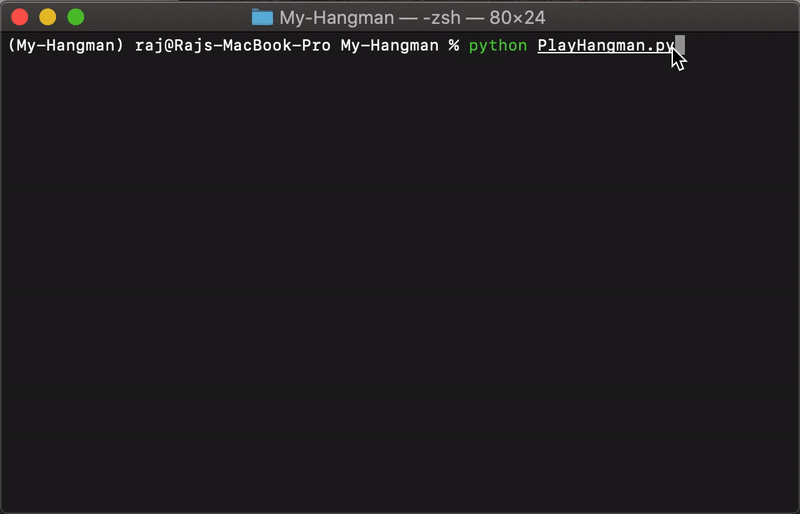

# Hangman
> My first python project.  :flushed:
> Includes a package built for all methods required to build the game.
> One can create a simple version of hangman (using the package) with **less than 10 lines of code**
> Tags: hangman, simple hangman, hangman package, game, game package, play hangman.

 

 

