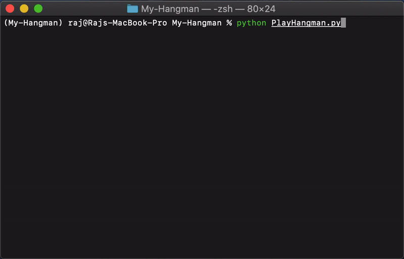
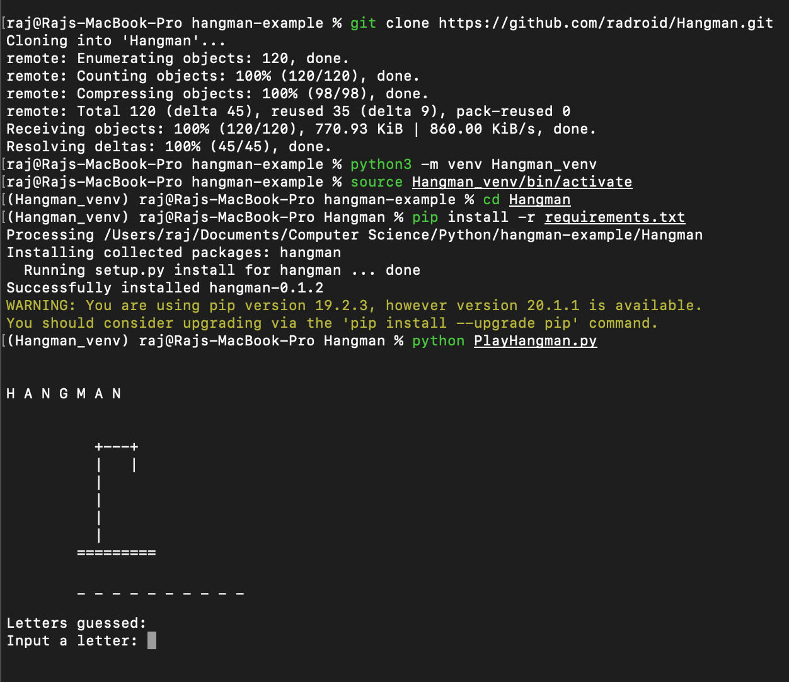

# Hangman
My **first python** project.  :nerd_face:
Includes a package - '**hangman**' - with all methods required to build the game.

> One can create a simple version of hangman (using the package) with **less than 20 lines of code**

[](https://forthebadge.com) 
[](https://forthebadge.com) 
[](https://forthebadge.com)

*Tags: hangman, simple hangman, hangman package, game, game package, play hangman.*


[](https://github.com/radroid/Hangman/blob/master/LICENSE) 
 
[](https://github.com/radroid/Hangman/pulls) 
[](https://github.com/radroid/Hangman/pulls?q=is%3Apr+is%3Aclosed)



**Watch** :eye: repository to get notified on updates (or :star2: and visit back).

## Table of Contents
* [Introduction](#hangman)
* [Setup](#setup)
    * [For a Mac/Linux User](#for-a-maclinux-user)
    * [For a Developer](#for-a-developer)
      * [Installing Hangman Package](#installing-hangman-package)
      * [Code Review](#code-review)
* [Project Status](#project-status)
* [Support](#support)
* [License](#license)

## SETUP
### For a Mac/Linux User

> Refer to the image at the end of this section to verfiy each step.

1. Download the latest [version of python](https://www.python.org/downloads/) on your computer.

2. Open terminal.

3. Navigate to the directory of your choice **or** continue with the Home directory.
```bash
# Hint: use 'ls' and 'cd' commands
ls # to list files and directories in the current directory.
cd [dir_name] # to change directory to '[dir_name]'.
````

4. Clone this repository:
```bash
git clone https://github.com/radroid/Hangman.git
```
*Wait for installation of necessary tools to be completed.*

5. Change directory and create a virtual environment to run the program.
```bash
cd Hangman
python3 -m venv Hangman_venv
source Hangman_venv/bin/activate
```

6. Install dependencies and run tests.
```bash
pip install -r requirements.txt
pytest # Runs tests to check if everything is in order.
```
*If any of the tests fail, please contact me or [create an issue](https://github.com/radroid/Hangman/issues).*

7. Finally, run the program! :partying_face:
```bash
python hangman/examples/PlaySimpleHangman.py
```

8. Bonus - Try out the second example for a more engaging game:
```bash
python hangman/examples/PlayHangman.py
```

**Setup example**



### For a Developer
The main python code is `hangman/HangmanGame.py`. The python module consists of a single class: `HangmanGame`. This class contains all the methods needed to play the game. A '.txt' file contains the word bank used in the game (see `hangman/data/word_bank.txt`).

#### Installing Hangman Package
1. Clone the repository on your device.
```bash
git clone https://github.com/radroid/Hangman.git
```
2. Open terminal and create a virtual environment. 

> (Refer to the steps provided in the [Setup section](#setup)

3. Use the following command to install package in the environment.
```bash
python setup.py install
```
*Note: ensure you are in the `Hangman` repo directory. When you list all the files and directories (using `ls`), you should see `setup.py`.*

4. You can now import the package into your python program, create an instance and build a unique version of the hangman game.
```python
from hangman import HangmanGame

# Instantiate the class.
hangman_game = HangmanGame()

# Start with a word.
hangman_game.set_word()

# Guess till you get it right or run out of guesses.
while hangman_game.get_status() == 'guessing':
    print(hangman_game.get_hangman())
    print(hangman_game.get_position())
    hangman_game.guess_letter()

# Check the result of the game.
if game.get_status() == 'won':
    print('You won!')
else:
    print('You ran out of guesses.')
    print(f'The word is: {hangman_game.get_word()}')
```
The above code (without any whitespaces and comments) is **12 lines long.**

#### Code Review
I would really appreciate any kind of feedback on the way I have chosen to tackle this problem. I am a beginner, so even a small piece of advice can go a long way. Be as critical as you can! Thank you for spending time looking at my code.

The best way to start is by going through the example codes in `hangman/examples`.
I would appreciate comments on anything and everything, but here are some to get you started:
- Architecture or **Design** of the code.
- Style and **Documentation**.
- **Testing**: this one can be get time consuming compared to the others.

You can refer to [this guide](https://www.kevinlondon.com/2015/05/05/code-review-best-practices.html) for advice on Code Reviews.

## Project Status
I tried to follow all the best practices of building a project as a software developer. This was the first step I took to understand some of the techniques and use them in practice. For now, I have acheived everything I wanted to from this project. If you have any other ideas we could work on, please [let me know](mailto:raj9dholakia@gmail.com).

## SUPPORT
I am looking for a job opportunity as a Software Developer and eventually Machine Learning Engineer in Canada. It would mean a lot if we could connect and discuss what we can do for each other. Follow and reach out to me on one of the following places ⬇️

 

## LICENSE

[](https://github.com/radroid/Hangman/blob/master/LICENSE)

**[MIT license](https://opensource.org/licenses/MIT)**
